# HackTheBox - Active

## Introduction
This box was on the category of easy god knows why cause i did not feel anything easy about it. However i took a lot of references and helps while solving this one. To be honest, i did not do this one on my own. But it was a mouthful of learning. That being said, let's get into our walkthrough.

### 1. Enumeration
When i joined the box, i got an ip address of `10.10.10.100`. As usual I fired up my terminal and started a `nmap` scan for top ports and all ports.
```bash
> nmap -sC -sV -T4 -A -oN nmap_initial 10.10.10.100
> nmap -sC -sV -T4 -p- nmap_all_ports 10.10.10.100
```
And while the scans were running i went to see if a website is present at the given url but there wasn't any. Finally our first nmap scan produced some output:

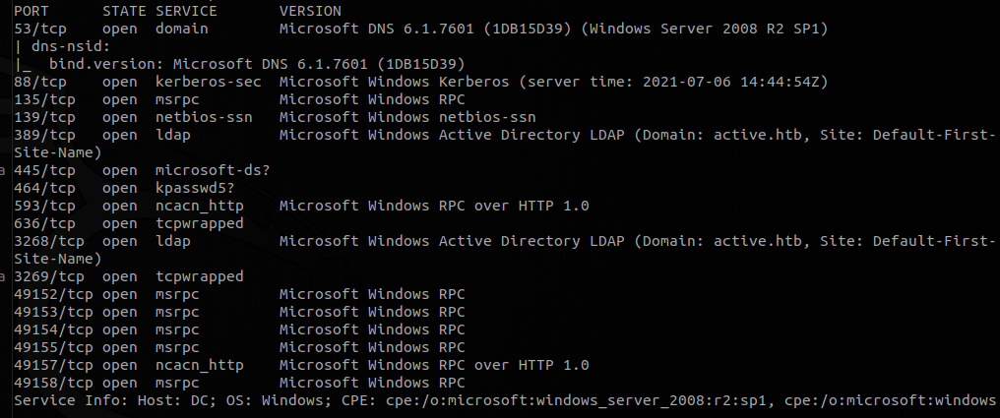

Looking at the nmap scan results, we can derive few conclusions:
- DNS service is open on port 53
- Kerberos running on port 88
- LDAP running on port 389
    - LDAP is also providing a domain name *active.htb*
- SMB service running on port 445

We saw that the SMB service is active, i decided to test if some file shares are available to anonymous users.
```bash
> smbclient -L //10.10.10.100
```
and then when asked for password just hit `Enter`. It's gonna do a null authentication or we can say anonymous authentication.

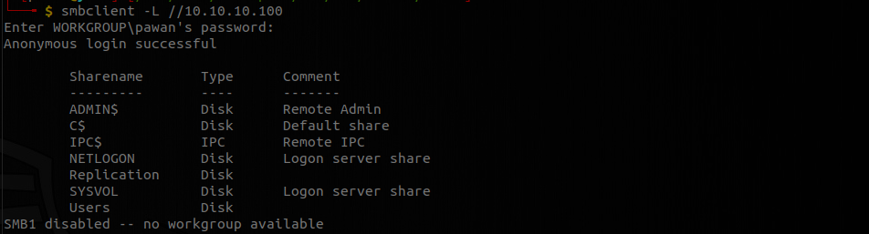

Here we can see all the shares we are allowed. Now we don't see which shares we have permissions to access. For this i commonly use `smbmap`.
```bash
> smbmap -H 10.10.10.100
```

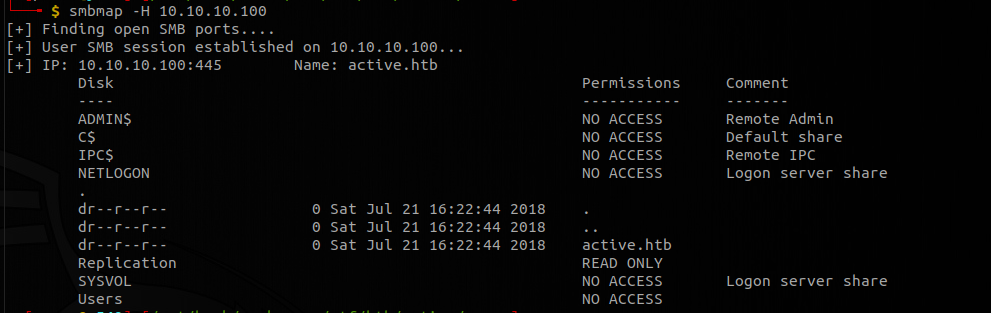

This lists all the file shares and what permission we have. Looking at the output we can deduce that we only have access to **Replication** directory.
```bash
> smbmap -R Replication -H 10.10.10.100
```
and this lists the contents of **Replication** directory. If we look through this, we see **'Groups.xml'**, that is a group policy file where local account information are stored.

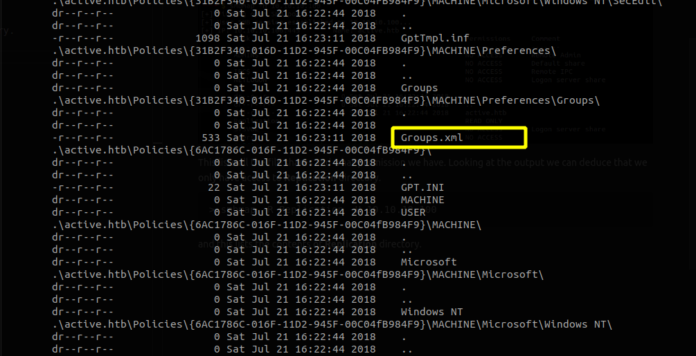

```
> smbclient //10.10.10.100/Replication
```

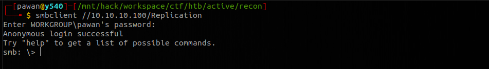

Now let's download the file and see the content of the file **Groups.xml**.

```
> get active.htb\Policies\{31B2F340-016D-11D2-945F-00C04FB984F9}\MACHINE\Preferences\Groups\Groups.xml
```
It has downloaded **Groups.xml**.

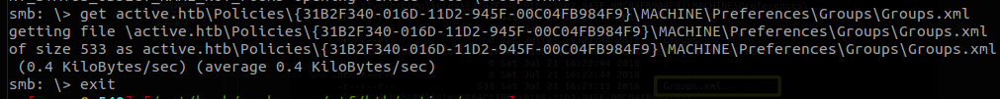

Now viewing the content of the file,

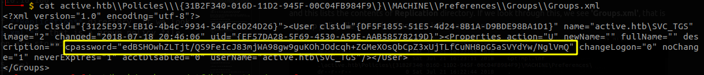

we can see this is for account active.htb/SVC_TGS. And we have encrypted password in `cpassword`. So we can use `gpp-decrypt` to crack the hash 

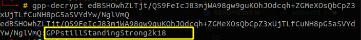


and we get the password as `GPPstillStandingStrong2k18`.

### 2. User flag
Now we can use `GetADUsers.py` from `impacket` to see the users in the box:
```bash
> GetADUsers.py -all -dc-ip 10.10.10.100 active.htb/SVC_TGS
```

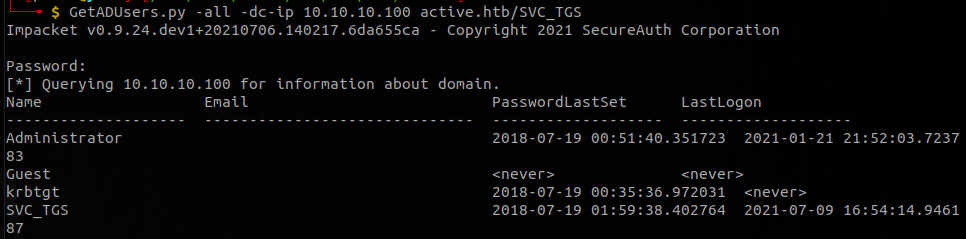

when asked for password, we provide currently found **active.htb/SVC_TGS** user's password i.e. **GPPstillStandingStrong2k18**. And we can see there are 4 users in the box.

Now let's use this user's creds and check if we have more access than anonymous user.
```
> smbmap -d active.htb -u svc_tgs -p GPPstillStandingStrong2k18 -H 10.10.10.100
```

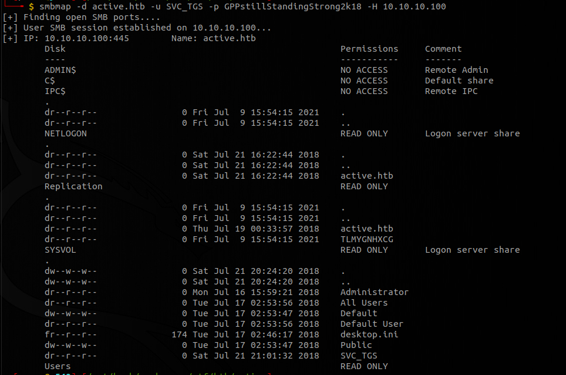

Now we have access to more shares. We can do same thing as we did last time for **Users**
```bash
> smbmap -d active.htb -u svc_tgs -p GPPstillStandingStrong2k18 -H 10.10.10.100 -R Users
```

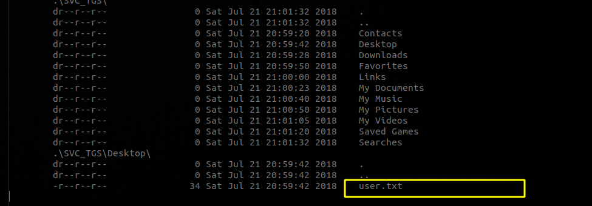

and here we find our user flag.

### 3. Root flag
Now if we return to our nmap scan, we will see that we have kerberos running on port 88 and we will go for `kerberoasting`.

Now let's run `GetUserSPNs.py` from impacket to get spn tickets.

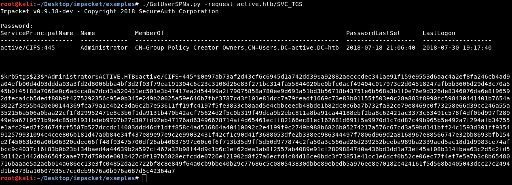

> Note: i couldn't get this to work because of my time zone.

Now let's save this in a file name **admin**. And we will use hashcat to crack this hash.
```
hashcat -m 13100 admin /path/to/wordlist.txt
```
which will find the output as `Ticketmaster1968`.

Now we can use this credentials with `psexec.py` of impact to have root access on the box:

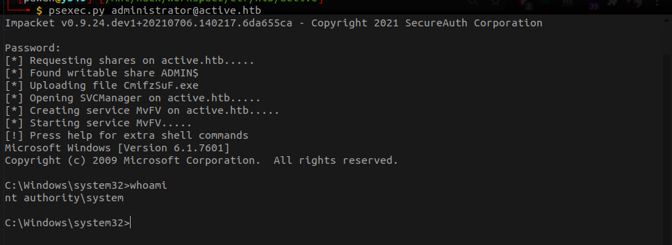

Now we can get the root flag.
